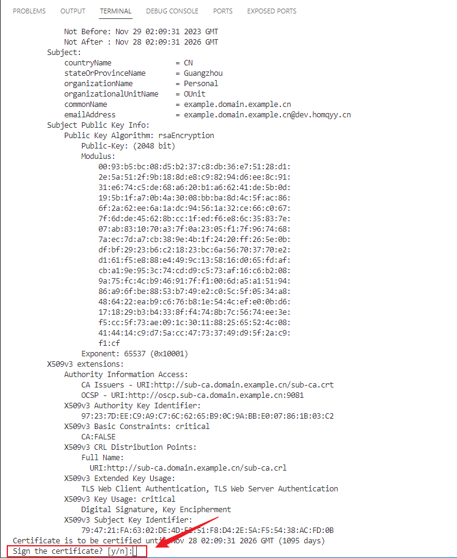

# CertManager

Certificate Management Tool

## Development Plan

- [x] Support ECDSA
- [x] Virtual environment
- [ ] Refactor `csr.conf` and `settings.conf` schemes
- [ ] Support specifying ECDSA curve names
- [ ] Support certificate renewal
- [ ] Utilize `subenv` as a variable substitution tool

## Deployment and Usage

1. Set up the configuration file `settings.conf`:

    ```text
    g_conf_name="YourName"
    g_conf_domain_suffix=domain.example.cn
    g_conf_organization="YourOrganization"
    g_conf_organization_unit="Your OUnit"
    g_conf_password=root
    ```

    - `g_conf_name`: Name of the certificate owner
    - `g_conf_domain_suffix`: Certificate domain suffix, also determines the domain names of the certificates that can be generated subsequently
    - `g_conf_organization`: Organization to which the certificate owner belongs
    - `g_conf_organization_unit`: Organizational unit to which the certificate owner belongs
    - `g_conf_password`: Password for the CA key

2. Clone the repository to a Linux host

    ```bash
    https://github.com/Homqyy/certm.git 
    ```

3. Build and install "Certm":

    ```bash
    ./build.sh -i
    ```

4. After successful installation, enter the virtual environment with the following command:

    ```bash
    source ./bin/activate.sh
    ```

5. Once inside the virtual environment, you can use the `certm-*` toolset, for example:

    ```bash
    certm-mkcert example
    ```

6. After use, exit the virtual environment with the following command:

    ```bash
    deactivate
    ```

### Virtual Environment

The purpose of the virtual environment is twofold:

1. Isolate different versions or instances of the certm environment
2. Avoid polluting the system environment

For example, you can install multiple certm environments on the same machine. When you need to use one, simply enter the corresponding virtual environment. Virtual environment commands are as follows:

```bash
Usage: source ./bin/activate.sh [options]

Options:
  -h, --help                  Show this help message and exit
  -n, --name  <venv name>     Set the name of the virtual environment
```

- `-n/--name`: Name of the virtual environment, default is the root directory name, e.g., `certm`.

To enter the virtual environment, use the following command:

```bash
source ./bin/activate.sh -n certm-1
```

- The above command will enter the `certm-1` virtual environment. The command prompt will change to something like:

    ```text
    (certm-1) [admin@cloud-host certm]$
    ```

    - Here, `certm-1` is the virtual environment name.

- Once a virtual environment name is set, it will be remembered. The next time you enter the virtual environment, you don't need to specify the virtual environment name, for example:

    ```bash
    source ./bin/activate.sh
    ```

### certm-mkcert

Certificate generation tool; the generated certificates are placed in the `output/clients` and `output/servers` directories, depending on whether they are client or server certificates. There are also subdirectories `gm` and `rsa`, storing GM and RSA certificates, respectively.

Usage:

```bash
Usage: certm-mkcert [OPTIONS] <domain_name>
Options:
  -b, --begin <DATE>                      Begin date, default is now
  -d, --debug                             Enable debug mode
  -e, --end   <DATE>                      End date, default is 1095 days
  -g, --gm                                Enable gm (deprecated, use "-t SM2" instead)
  -h, --help                              Show help
  -s, --server                            Server certificate, default is client
  -t, --type  <rsa | ecdsa | sm2>         Certificate Key type, default is 'rsa', 

DATE: format is YYYYMMDDHHMMSSZ, such as 20201027120000Z

Example: /home/admin/workspaces/certm/src/tools/mkcert.sh example
```

- `domain_name`: Certificate domain, can be a subdomain or third-level domain. It will automatically concatenate with the domain suffix `g_conf_domain_suffix` to form the complete domain, e.g., `example` will be concatenated to `example.example.cn`.
- `-b/--begin`: Certificate effective date, default is the current time
- `-d/--debug`: Enable debug mode, prints the script execution process when enabled
- `-e/--end`: Certificate expiration date, default is 1095 days later
- `-g/--gm`: Enable GM certificate (SM2 certificate), this option is deprecated, use `-t/--type sm2` instead
- `-h/--help`: Show help information
- `-s/--server`: Generate server certificate, default is client
- `-t/--type`: Certificate type, supports RSA, ECDSA, and SM2, default is RSA

When generating a certificate, the certificate information is printed to the standard output. You can check if the certificate information is correct. If it is, press `y` to agree to generate the certificate, otherwise press `n` to not generate the certificate:



### certm-genca

Export CA certificate tool; exports the CA to the `output/ca` directory. Usage:

```bash
certm-genca
```

View the `output/ca` directory:

```text
[admin@cloud certm]$ ls -l output/ca/
total 32
-rw-rw-r-- 1 admin admin 2543 Nov 29 09:48 ca-all.pem.crt
-rw-rw-r-- 1 admin admin 1807 Nov 29 09:48 ca-chain-gm.pem.crt
-rw-rw-r-- 1 admin admin 4221 Nov 29 09:48 ca-chain.pem.crt
-rw-rw-r-- 1 admin admin  664 Nov 29 09:48 ca-gm.pem.crt
-rw-rw-r-- 1 admin admin 1879 Nov 29 09:48 ca.pem.crt
```

- `ca-all.pem.crt`: Contains all CA certificates in the certificate chain (GM and RSA)
- `ca-chain-gm.pem.crt`: Contains the GM certificate chain (root and intermediate certificates)
- `ca-chain.pem.crt`: Contains the RSA certificate chain (root and intermediate certificates)
- `ca-gm.pem.crt`: GM root certificate
- `ca.pem.crt`: RSA root certificate

### certm-gencrl

Export CRL tool; exports the CRL to the `output/ca` directory. Usage:

```bash
certm-gencrl
```

### certm-revoke

Certificate revocation tool; usage:

```bash
Usage: certm-revoke [OPTIONS] <domain_name>
Options:
 

 -h, --help          Show help
  -s, --server        Server certificate, default is client
  -g, --gm            GM Certificate, default is rsa
```

- `domain_name`: Certificate domain name, consistent with the domain name used in the `certm-mkcert` command
- `-s/--server`: Whether it is a server certificate, default is client certificate
- `-g/--gm`: Whether it is a GM certificate, default is an RSA certificate

## build.sh

```bash
Usage: ./build.sh [options]
Options:
  -h, --help      Show this help message and exit
  -c, --clean     Clean all the build files: dependencies + certm
  -d, --debug     Enable debug mode
  -i, --install   Install certm
  -u, --uninstall Uninstall certm
  -r, --rebuild   Rebuild certm
```

- `-c/--clean`: Clean all build files, including dependencies and certm; equivalent to restoring to the state when the repository was just cloned.
- `-d/--debug`: Enable debug mode, prints the script execution process.
- `-i/--install`: Install certm; after installation, the `certm-*` toolset can be used.
- `-u/--uninstall`: Uninstall certm.
- `-r/--rebuild`: Rebuild certm; deletes the `output` directory, so if the results in this directory are still needed, please copy them in time.